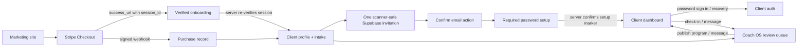

# Coach Murray v2 Architecture

## Canonical journey

## Deployable layout

- `public/index.html`: public marketing entry point.
- `public/quiz.html`: public coaching quiz.
- `client/app.html` + `client/src`: Vite React application for onboarding, client portal, and Coach OS.
- `netlify/functions`: the only privileged integration boundary.
- `shared/contracts.ts`: request validation and shared payload types.
- `supabase/migrations`: canonical schema, functions, indexes, and row-level security.
- `dist`: generated Netlify publish directory; source files and legacy prototypes are excluded.

## Security boundaries

- Stripe Checkout session IDs are verified with the Stripe secret key before onboarding is shown and again before intake persistence.
- Stripe webhook payloads use raw-body signature verification and idempotent purchase upserts.
- Supabase Auth access tokens are verified server-side with `auth.getUser()`.
- Every protected render preflights `session-context`; a browser session alone never proves client linkage or coach authorization.
- Paid onboarding sends at most one atomically claimed invitation. A confirmed invite session remains blocked by RLS and server functions until a password update records `account_setup_completed_at`.
- Coach access is derived from signed `app_metadata.role`, never browser-controlled `user_metadata`.
- `SITE_URL` is required and validated as an HTTPS origin before invitations or Stripe Billing Portal sessions are created; there is no production-domain fallback.
- Only paid sessions from the explicitly allowlisted Stripe Payment Links may unlock onboarding.
- The first verified intake is immutable for a Checkout Session and records a terms version plus signature digest; later edits require a separate authenticated workflow.
- Service-role, Stripe, Resend, and webhook secrets exist only in Netlify environment variables.
- RLS is enabled on every exposed table; clients can read only records linked through their `auth.uid()` after account setup is complete.
- Card numbers and CVC never enter Coach Murray forms. Billing changes use Stripe Billing Portal.

## Account lifecycle states

| State              | Server evidence                                                                                                      | Client action                                                     | Coach recovery                                                           |
| ------------------ | -------------------------------------------------------------------------------------------------------------------- | ----------------------------------------------------------------- | ------------------------------------------------------------------------ |
| Checkout required  | No verified, allowlisted paid Checkout Session                                                                       | Complete Stripe Checkout                                          | None                                                                     |
| Intake ready       | Paid session verified; intake not yet stored                                                                         | Complete onboarding with the checkout email                       | Review checkout or intake failure                                        |
| Invitation pending | Immutable intake exists; Auth email is unconfirmed                                                                   | Open the scanner-safe invitation and select **Continue securely** | Resend after the cooldown; Supabase rotates the unconfirmed invite token |
| Password pending   | Auth email is confirmed but the linked profile has no setup marker; Auth's internal invitation password never counts | Set a password from the active invite/recovery session            | **Resend account setup** falls back to password recovery for this state  |
| Client ready       | Confirmed Auth user, nonempty password, paid completed purchase, and linked profile                                  | Sign in at `/sign-in`; server routes to `/dashboard`              | Manage from Coach OS                                                     |

An intake replay never creates another invitation. A lost unconfirmed invitation can be reissued after the cooldown. If the email was already confirmed but password setup was abandoned, the coach action sends a recovery link instead; both links converge on the same password-update trigger and server-side readiness check.

## Removed legacy paths

The standalone `onboarding.html`, `portal.html`, `admin.html`, raw JSX prototypes, compiled historical assets, and deployment script remain in the workspace only as provenance. `netlify.toml` publishes `dist`, so none are reachable in production.

The two legacy Supabase project references are not used by the v2 application. One approved canonical Supabase project must receive the migration and environment configuration.
