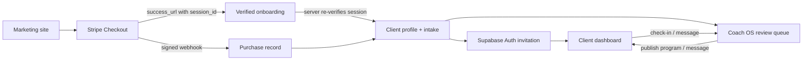

# Coach Murray v2 Architecture

## Canonical journey

## Deployable layout

- `public/index.html`: public marketing entry point.
- `public/quiz.html`: public coaching quiz.
- `client/app.html` + `client/src`: Vite React application for onboarding, client portal, and Coach OS.
- `netlify/functions`: the only privileged integration boundary.
- `shared/contracts.ts`: request validation and shared payload types.
- `supabase/migrations`: canonical schema, functions, indexes, and row-level security.
- `dist`: generated Netlify publish directory; source files and legacy prototypes are excluded.

## Security boundaries

- Stripe Checkout session IDs are verified with the Stripe secret key before onboarding is shown and again before intake persistence.
- Stripe webhook payloads use raw-body signature verification and idempotent purchase upserts.
- Supabase Auth access tokens are verified server-side with `auth.getUser()`.
- Coach access is derived from signed `app_metadata.role`, never browser-controlled `user_metadata`.
- Service-role, Stripe, Resend, and webhook secrets exist only in Netlify environment variables.
- RLS is enabled on every exposed table; clients can read only records linked through their `auth.uid()`.
- Card numbers and CVC never enter Coach Murray forms. Billing changes use Stripe Billing Portal.

## Removed legacy paths

The standalone `onboarding.html`, `portal.html`, `admin.html`, raw JSX prototypes, compiled historical assets, and deployment script remain in the workspace only as provenance. `netlify.toml` publishes `dist`, so none are reachable in production.

The two legacy Supabase project references are not used by the v2 application. One approved canonical Supabase project must receive the migration and environment configuration.
